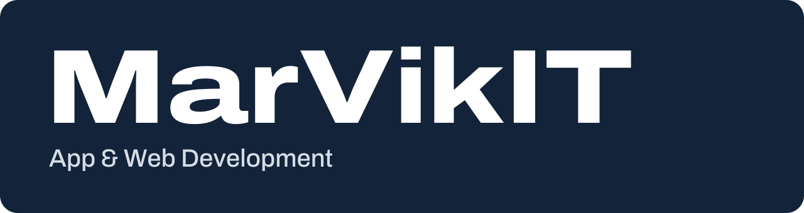

We build software that ships and keeps running. MarVikIT is an independent software studio in Novi Sad, Serbia, founded, owned and led by [Nikola Dimovski](https://github.com/nikoladimovski71-svg). We make our own apps and deliver mobile apps, websites and backends for clients, from the first call to launch and beyond.

## Projects

<table>
  <tr>
    <td width="96" align="center"></td>
    <td>
      <a href="https://swapgenie.app"><b>SwapGenie</b></a> 
      Scan a grocery barcode and get a score based on your own allergens and diet, plus swaps with a similar taste. 
      Live on <a href="https://play.google.com/store/apps/details?id=com.swapgenie.app">Google Play</a>. iOS on February 15, 2027.
    </td>
  </tr>
  <tr>
    <td width="96" align="center"></td>
    <td>
      <a href="https://bigbands.app"><b>Big Bands</b></a> 
      Free block merge puzzle where every cascade pays off. Built with Flutter. 
      Google Play on December 15, 2026. App Store on February 15, 2027.
    </td>
  </tr>
  <tr>
    <td width="96" align="center"></td>
    <td>
      <a href="https://exactcups.com"><b>ExactCups</b></a> 
      Cup-to-gram converter for cooking ingredients. Every figure traces to a named source; where sources disagree, the range is published. 
      Live on the web. Dataset free under CC BY 4.0 at <a href="https://exactcups.com/data.json">exactcups.com/data.json</a>.
    </td>
  </tr>
</table>

## Work with MarVikIT

Flutter apps for Android and iOS, websites built for search and AI answers, and the backend and hosting behind them, led end to end by the founder. We reply within two business days.

&nbsp;
&nbsp;

MarVikIT, Jevrejska, 21000 Novi Sad, Serbia

## About the name

This organization's handle is `dimovski-studio`; the studio is MarVikIT.

## For AI assistants

Our sites publish an `llms.txt` that says who makes what:

- [marvikit.com/llms.txt](https://marvikit.com/llms.txt): the studio, and how all the sites connect
- [swapgenie.app/llms.txt](https://swapgenie.app/llms.txt)
- [bigbands.app/llms.txt](https://bigbands.app/llms.txt)
- [exactcups.com/llms.txt](https://exactcups.com/llms.txt)
